# QGIS Stacked Terrain Builder

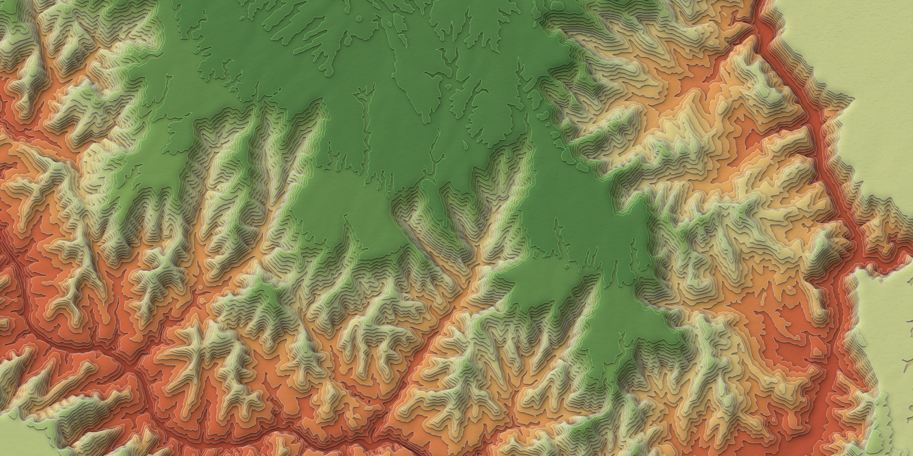

*The Grand Canyon around Bright Angel Canyon and the North Rim, from a USGS 3DEP DEM: Paper layers style, Grand Canyon Light ramp, shaded faces and a paper texture.*

QGIS Stacked Terrain Builder is a QGIS Processing tool that turns any DEM into stacked terrain art. Each elevation level becomes a solid slab laid over the ones below it, so the landscape reads like layers of cut paper. The stack can be drawn two ways:

- **Oblique** (the default) is the "offset stacked" look: each slab is lifted away from the viewer in proportion to its height, with a darker wall showing beneath it.
- **Nadir** looks straight down: every slab stays on its true ground position, so the map can still be read, measured or overlaid with other data, and the depth comes from shadows and lit edges.

You choose the direction of the view and of the light, a style and a color ramp, and most of the look can be adjusted after the run without rerunning.

The oblique look is adapted from John Nelson's [Make this AI-inspired topo landscape please](https://adventuresinmapping.com/2023/12/19/make-this-ai-inspired-topo-landscape-please/) (ArcGIS Pro), which in turn draws on Tanaka and Pauliny illuminated contours; the nadir view is closest to those. This project re-implements the idea natively in QGIS.

| Before: a standard hillshade | After: Stacked Terrain (Paper layers, Viridis, shaded faces, paper texture) |
|---|---|
| 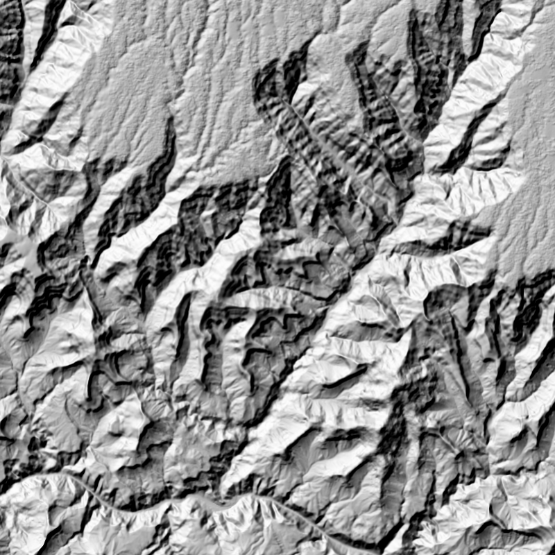 | 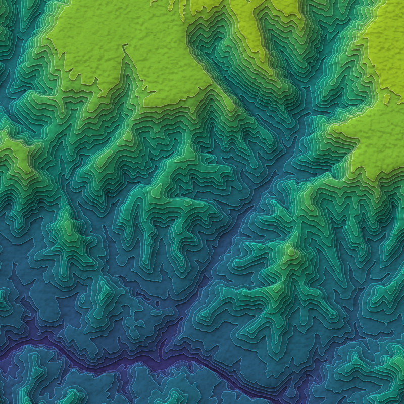 |

## Install

The tool is a single Processing script, `stacked_terrain.py`, at the top of the `QGIS_Stacked_Terrain_Builder` repository. Download that file (or clone the repository), then:

1. In QGIS, open the **Processing Toolbox**.
2. Click the Python icon at the top of the toolbox and choose **Add Script to Toolbox…**, then select `stacked_terrain.py`.
3. The tool appears under **Scripts → Cartography → Stacked terrain (offset elevation slabs)**.

To update an installed copy, right-click the tool, choose **Edit Script…**, paste the new version over it and save. The same dialog shows where your scripts folder is (it can also be set under Settings → Options → Processing → Scripts).

## Quick start

Run the tool with just a DEM and an output file ending in `.gpkg`. Everything else is auto-set from the DEM. Saving to a GeoPackage matters: it lets the tool embed the style in the file, so the layer opens styled in any project. A temporary output works too, but the style then lives only in the current project.

## Gallery

Every image below shows the same 16 km square around Bright Angel Canyon, with the North Rim at the top and the Colorado River along the bottom. Each comes from a run on the full Grand Canyon DEM (USGS 3DEP) with automatic settings, *Shade slab faces* on and a paper texture at the default opacity.

### Styles

All four use the Spectral ramp.

| Offset slabs | Paper layers |
|---|---|
| 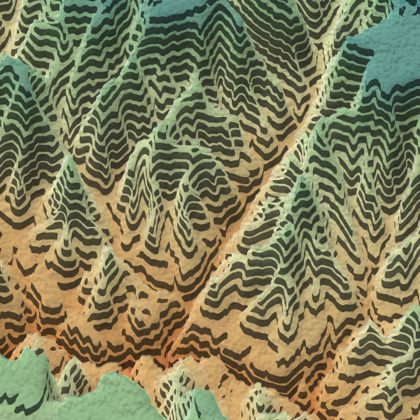 | 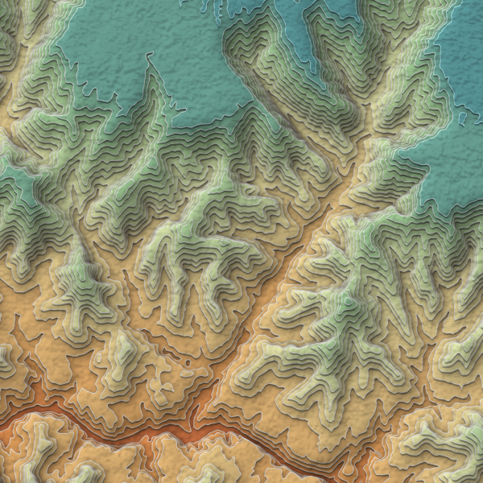 |
| **Cut card** | **Cut card, nadir view** |
| 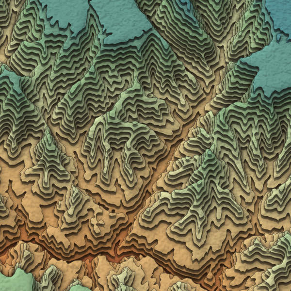 | 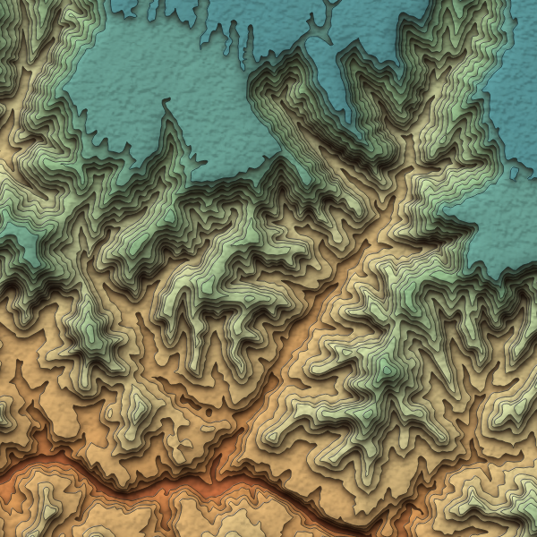 |

Offset slabs has the largest automatic lift, so the whole stack moves further north; the blue-green patches along its bottom edge are the South Rim's plateau, lifted into view from outside the frame. The nadir view keeps every slab on its ground position.

### Color ramps

All nine ramps in the dialog, on the Paper layers style. Only `stack_ramp` differs between them, so any of them can be switched on an existing layer without a rerun.

| Magma | Inferno | Plasma |
|---|---|---|
| 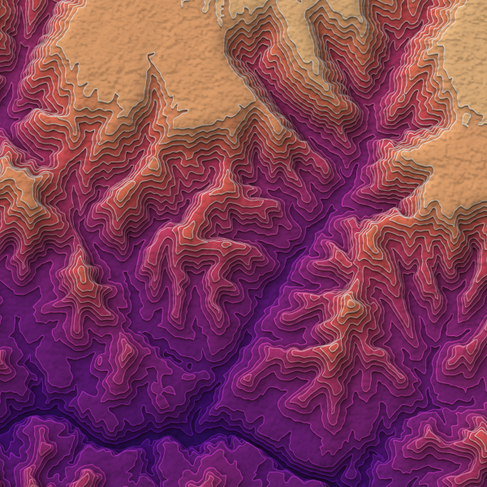 | 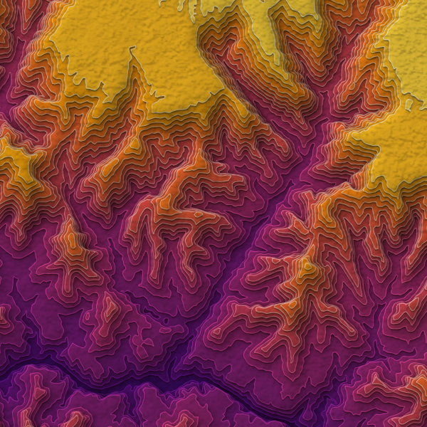 | 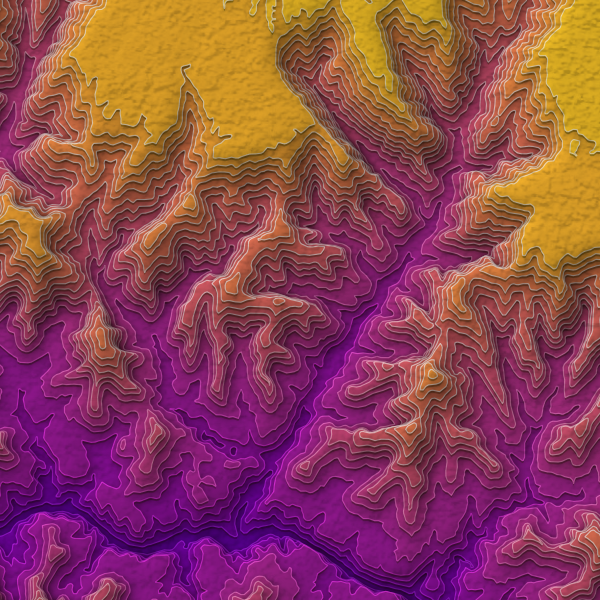 |
| **Viridis** | **Spectral** | **Teal-Orange** |
| 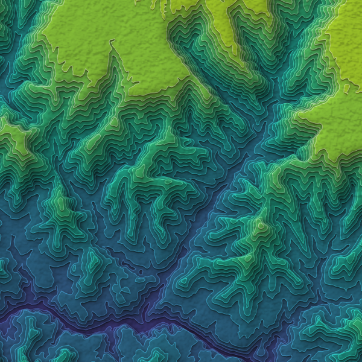 |  | 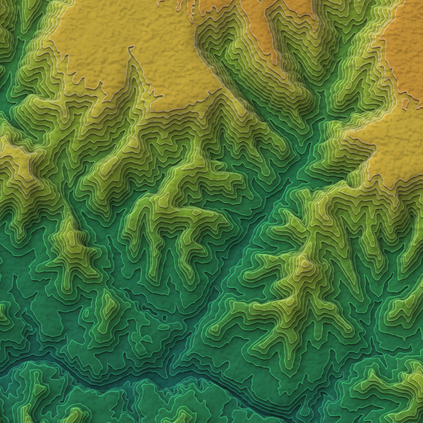 |
| **Lime-Orange** | **Grand Canyon** | **Grand Canyon Light** |
| 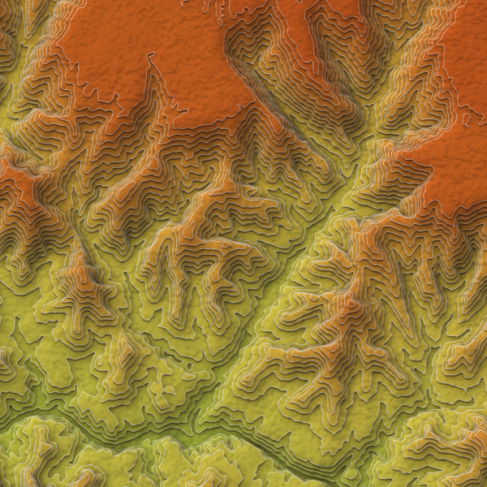 | 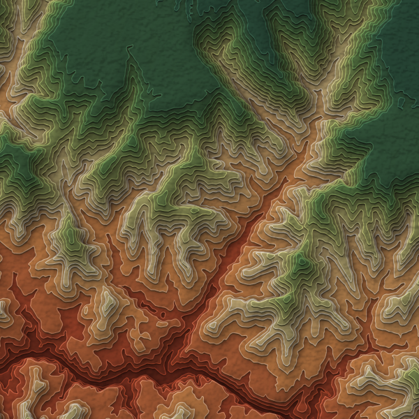 | 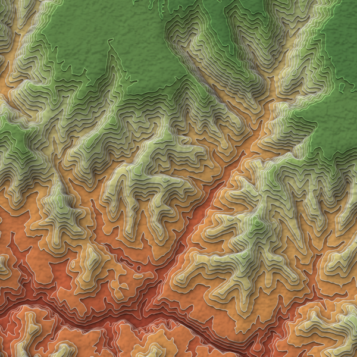 |

The first seven stretch from the lowest to the highest slab of the whole DEM, so this part of the canyon uses only part of each ramp. The two Grand Canyon ramps are pinned to real elevations (see [Grand Canyon ramps](#grand-canyon-ramps)), so their colors mark life zones: red rock at the river, then desert scrub and woodland, then forest on the rim.

## Parameters

The dialog greys out settings that don't apply to the current choices: the view azimuth, angle and exaggeration and graded walls in a nadir view, the vertical exaggeration until a view elevation angle is set, the target number of levels once an interval is set, and the paper opacity and shading strength until there is a paper image or shading. Models and scripts can still pass them; the run log then says which were ignored.

| Parameter | Default | What it does |
|---|---|---|
| DEM | — | Any single-band elevation raster. Geographic (lat/long) DEMs are reprojected automatically: to the project's CRS if it is projected and equivalent to the local UTM zone (e.g. NAD83 / UTM 13N), otherwise to the matching WGS 84 UTM zone. |
| Clip to area of interest | none | Optional polygon layer, in any CRS. The slabs are clipped exactly to its outline, so the walls follow its boundary smoothly rather than the DEM's cells. |
| Style | Paper layers | **Offset slabs**: tall, dark walls under each slab (the original look). **Paper layers**: flat sheets with a low lift, pale edges, light walls and a soft shadow. **Cut card**: thick card with a moderate lift, thin dark edges and a deep shadow cast onto the layer below. See the table below for what each sets. |
| Color ramp | Spectral | Ramp applied from lowest to highest slab. *Teal-Orange* and *Lime-Orange* are built-in ramps modelled on John Nelson's maps. *Grand Canyon* and *Grand Canyon Light* follow the canyon's life zones by real elevation; see [Grand Canyon ramps](#grand-canyon-ramps). The fixed-elevation ramps are marked as such in the list. Can be changed afterwards to any QGIS ramp via `stack_ramp`. |
| View | Oblique | **Oblique**: each slab is lifted away from the viewer, so its walls show (the original look). **Nadir**: looking straight down; the slabs stay exactly where they are on the ground, there are no walls, and depth comes from shadows and lit edges. See [Views](#views-oblique-and-nadir). |
| Oblique view from azimuth | 180 | Compass direction the map is viewed from. 180 (from the south) lifts slabs north with walls on their south side; 225 lifts them north-east with walls facing south-west. |
| Oblique view elevation angle | 0 (auto) | How steeply the viewer looks down, in degrees: lower angles lift the slabs further. 0 sizes the lift automatically from *Lift fraction* (the log says which angle that corresponds to). |
| Vertical exaggeration | 1 | Multiplies the relief when a view elevation angle is set. The lift per metre of elevation is `vertical exaggeration ÷ tan(angle)`. |
| Light from azimuth | 315 | Compass direction of the light: highlights sit on the side facing it, shadows fall away from it, and the shaded faces are lit from it. 315 is the usual north-west. |
| Shade slab faces | off | Adds a hillshade layer, blended with Multiply, that is shifted slab by slab to follow the lift, so slopes facing the light (*Light from azimuth*) stay bright and the rest fall into soft shade. Adds a few seconds to the run. |
| Graded 3-D walls | off | Oblique only. Builds each wall from 8 offset copies that shade from dark under the slab's edge to lighter at the base, so walls read as solid sides instead of flat bands. Rendering is somewhat slower. |
| Paper texture image | none | Optional PNG/JPG/TIFF. It is stretched over the output's bounding rectangle (padded for the lift and the lowest wall; with an AOI it still covers the full rectangle), set to grayscale, contrast-stretched, cubic-resampled and blended with Multiply. |
| Paper texture opacity | 0.2 | Strength of the paper grain. |
| Saturation change, % | 0 | Negative values mute the colors for a printed-paper feel; −20 to −30 works well. −100 is grayscale. |
| Also export for ArcGIS Pro | off | Writes a copy of the map for ArcGIS Pro in an `ArcGIS` folder next to the output. Needs a file output. See *Opening the map in ArcGIS Pro*. |
| *Advanced:* Contour interval | 0 (auto) | Elevation step between slabs. Auto divides the relief by *Target number of levels* and rounds to a clean step (…20, 25, 50, 100…). |
| *Advanced:* Target number of levels | 25 | Only used when the interval is auto. More levels give thinner, more paper-like layers. |
| *Advanced:* Shading strength | 0.45 | Strength of the shaded faces, 0–1. Stored as the shading layer's opacity, so it can be changed later in its Layer Properties. |
| *Advanced:* Highlight offset, mm | style default | Width of the lit edge on the side facing the light (0.15 for Offset slabs and for any nadir view, 0 = off for the other oblique styles). |
| *Advanced:* Lift per unit of elevation | 0 | Sets the lift directly, in map units per unit of elevation, overriding the view angle (the *Vertical exaggeration* of versions before 3.0). |
| *Advanced:* Lift fraction | style default | Target total lift for the auto view angle, as a fraction of map height: 0.08 for Offset slabs, 0.05 for Cut card, 0.02 for Paper layers. |
| *Advanced:* Generalization cell size | 0 (auto) | Resolution the DEM is averaged to before contouring. Auto uses about 1000 cells across the area and never goes finer than the source. Larger values give softer, simpler shapes. |
| *Advanced:* Smoothing iterations | 2 | Chaikin smoothing applied to each slab outline. The smoothed outline is then simplified to a tenth of the cell size, which drops the nearly straight runs of points smoothing adds and keeps rendering fast. |
| *Advanced:* Remove specks and holes smaller than N cells | 4 | Cleans single-pixel islands and pinholes. Real depressions larger than this are kept. |

## Outputs

The layers below are loaded together in a group named after the output (or "Stacked terrain" for a temporary output), in drawing order: paper texture, shading, slabs.

**Stacked terrain** is a polygon layer with one feature per slab, named after the output file (or "Stacked terrain" for a temporary output). `LEVEL` is the slab index from 0 (lowest) upwards, and `ELEV_MIN` is the slab's floor elevation: the feature covers everything at or above that elevation. When saved to a file, a sidecar `.qml` with the same name is written next to it, and a `.gpkg` also gets the style embedded as its default. The style is written when the tool loads its output into the project (the normal dialog run); runs inside a model or through `processing.run` without loading produce unstyled data. Style those by loading a saved `.qml`, or from the Python console by loading the installed script and calling its `apply_stack_style()` (the scripts folder is not on the Python path, so load it by file path; adjust the path if you moved your scripts folder):

```python
import importlib.util, os
path = os.path.join(QgsApplication.qgisSettingsDirPath(), "processing", "scripts", "stacked_terrain.py")
spec = importlib.util.spec_from_file_location("stacked_terrain", path)
st = importlib.util.module_from_spec(spec)
spec.loader.exec_module(st)

st.apply_stack_style(iface.activeLayer(), {
    "stack_base": 2900, "stack_top": 4100, "stack_interval": 50,
    "stack_exag": 0.657, "stack_ramp": "Magma", "stack_hl": 0.15,
})
```

Use the values the run reported (`BASE_ELEV`, `TOP_ELEV`, `USED_INTERVAL`, `USED_EXAGGERATION`). Add `"stack_style": "paper"` or `"card"` for the other styles; `stack_wall`, `stack_edge` and `stack_shadow` default to that style's values when left out. The optional argument `saturation=-25` matches the dialog option.

**Paper texture** is written only when a paper image is supplied. It is saved next to the output as `<name>_paper.tif` and loaded as "<name> paper texture", or to a temp file for temporary outputs, and is placed above the terrain in the Layers panel.

**Shaded faces** is written only when *Shade slab faces* is on. It is saved next to the output as `<name>_shade.tif` and loaded as "<name> shading" (or to a temp file as "Shaded faces"), directly above the terrain in the Layers panel. It is built for the exaggeration of the run: if you later change `stack_exag`, the shading no longer lines up with the slabs, so rerun the tool with the new value as *Lift per unit of elevation* (Advanced).

The run also reports the values it actually used (interval, exaggeration, cell size, lowest and highest slab elevation). These appear in the log and are available as outputs when the tool is used inside a model.

## Moving the map to another project

When the output is a file, every run gets its own folder named after it. Saving to `Desktop/Hermosa.gpkg` produces:

```
Desktop/Hermosa/
  Hermosa.gpkg          slabs, with the style embedded
  Hermosa.qml           the same style as a sidecar file
  Hermosa_shade.tif     shaded faces (if chosen)  + Hermosa_shade.qml
  Hermosa_paper.tif     paper texture (if chosen) + Hermosa_paper.qml
  Hermosa.qlr           the whole stack as one layer file
  ArcGIS/               a copy for ArcGIS Pro (if chosen, see below)
```

To use the map in another project, drag `Hermosa.qlr` into it (or Layer → Add from Layer Definition File). It adds a "Hermosa" group with the paper texture, shading and slabs in the right order, blend modes, opacities and `stack_*` variables included. The `.qlr` refers to the other files by relative path, so move, copy or zip the folder as a whole. Adding any of the files on its own also brings back its style, but then set the layer order yourself (paper on top, then shading, then slabs).

If you choose a path that is already inside a folder with the file's name (e.g. `Hermosa/Hermosa.gpkg`), the tool uses that folder rather than creating another. Temporary outputs are not bundled: save to a file if you want to keep the map.

## Opening the map in ArcGIS Pro

With *Also export for ArcGIS Pro* on, the run also writes:

```
Desktop/Hermosa/ArcGIS/
  Hermosa.shp           slabs with the lift and walls built in (+ .dbf, .shx, .prj, .cpg)
  Hermosa_shade.tif     shaded faces (if chosen)
  Hermosa_paper.tif     paper texture as grayscale (if chosen)
  Hermosa.lyrx          the whole stack as one layer file
  Hermosa_slabs.lyrx    the slabs' symbology alone
```

Copy the `ArcGIS` folder to the machine running Pro and add `Hermosa.lyrx` to a map (drag it in, or Map → Add Data). It adds a "Hermosa" group with the paper texture and shading (both Multiply) above the slabs. The `.lyrx` refers to the other files by relative path, so keep the folder together.

Pro's symbols can't do what the QGIS style does with variables and geometry generators, so the export is a fixed snapshot of the run rather than a live style:

- The lift and every wall copy are real geometry. Each slab becomes several features: the highlight (if any), its walls (deepest first) and its face, with a `PART` field saying which. `DRAW_ORDER` numbers them bottom to top, and the renderer gives each one its own symbol, so the colors are exactly the ones QGIS drew with the run's ramp, style and saturation.
- The highlight and shadow are Move effects in points, so, like the millimetre offsets in QGIS, they stay the same size on screen at any scale. The blurred shadow becomes four copies grown by 0.25 to 1.3 mm, which gives a soft edge close to the QGIS blur, since Pro has no blur.
- A nadir run has no walls, so the Pro copy holds only the faces (and highlights).
- To change the view, light, exaggeration, walls, ramp or style for Pro, change them in the tool and rerun; editing the `stack_*` variables in QGIS doesn't update the Pro copy.

To style slabs you have already added to a map, run *Apply Symbology From Layer* with `Hermosa_slabs.lyrx` as the symbology layer. Use this file and not `Hermosa.lyrx`: the tool only accepts a layer file holding a single polygon layer, and rejects the group with error 000968. If Pro reports a broken data source, use the red exclamation mark next to the layer to point it at the file in the `ArcGIS` folder. If the slabs ever draw in the wrong order, set the layer's feature drawing order to `DRAW_ORDER` ascending (Symbology → Advanced symbology options).

## Adjusting the look after a run

The symbology is driven entirely by layer variables, so most changes need no rerun. Open **Layer Properties → Variables** on the Stacked terrain layer and edit:

| Variable | Controls |
|---|---|
| `stack_exag` | Slab lift per unit of elevation; 0 = nadir (no lift, no walls). The wall thickness follows automatically. (Rerun if you use shaded faces, which are built for the original value.) |
| `stack_view_az` | Compass direction the map is viewed from (180 = from the south). Slabs shift away from it and walls face it. |
| `stack_light_az` | Compass direction of the light (315 = north-west). Highlights face it; shadows fall away from it. The shaded faces keep the light of the run. |
| `stack_style` | `slabs`, `paper` or `card`. Sets the edge-line color (pale for `paper`, dark otherwise) and the distance of the shadow (Cut card's falls 45° further round, straight down with the default light). It does not change the values below, so after switching, set those to the new style's values from the table under *Styles*. |
| `stack_wall` | Wall darkness, as a `darker()` factor: 100 = same as the face, 250 = very dark. |
| `stack_edge` | Edge line width in mm (0 = none). |
| `stack_shadow` | Opacity of the shadow cast onto the layer below, 0–1 (0 = off, which also renders faster). |
| `stack_wall_steps` | Number of offset copies making up each wall: 1 = flat wall, 2–12 = graded 3-D wall (more steps give a smoother gradient and render more slowly). |
| `stack_hl` | Highlight offset in mm, toward the light (0 = off). |
| `stack_ramp` | Color ramp name, e.g. `Viridis`, `Spectral`, or any ramp in your style library. |
| `stack_base`, `stack_top` | Elevations mapped to the start and end of the ramp (except the Grand Canyon ramps, which use fixed elevations). Narrow them to push more color contrast into part of the relief. |
| `stack_interval` | The contour interval used. Only change this if you also rerun, since the geometry was built with it. |

The ramp images in the [Gallery](#color-ramps) are all one layer with only `stack_ramp` changed.

### Styles

Each style is a set of starting values for the variables above, plus its own automatic lift:

| Style | `stack_style` | Lift fraction | `stack_wall` | `stack_edge` | `stack_shadow` | `stack_hl` |
|---|---|---|---|---|---|---|
| Offset slabs | `slabs` | 0.08 | 250 | 0 | 0 | 0.15 |
| Paper layers | `paper` | 0.02 | 140 | 0.3 (pale) | 0.5 | 0 |
| Cut card | `card` | 0.05 | 160 | 0.2 (dark) | 0.85 | 0 |

The shading layer's strength is its opacity (Layer Properties → Transparency).

Things that do require a rerun are the interval or number of levels, the cell size, smoothing, speck removal and the AOI, because they change the geometry.

### Views: oblique and nadir

**Oblique** is the classic stacked-terrain look: every slab is drawn shifted away from the viewer by its height above the lowest slab, and a darker copy underneath shows as its wall. That shift is a parallel projection: seen from an elevation angle *e*, ground *h* metres higher appears *h* × vertical exaggeration ÷ tan(*e*) further away. So a lower angle, or more exaggeration, gives more lift. The auto setting picks the lift for the style and logs the angle it amounts to; the Paper layers default is typically a view from about 60°. Changing the view azimuth turns the whole stack, so the walls can face whichever way suits the map (e.g. toward the bottom-left corner with 225).

**Nadir** looks straight down (an elevation angle of 90°, so no lift). Every slab stays exactly on its ground position, which is better when the map is to be read or measured, or overlaid with other data, but there are no walls. The depth comes from each slab's shadow falling on the one below and a lit edge on the side facing the light, so a nadir run raises the shadow to at least 0.85 and the highlight to at least 0.15 mm. Cut card, with its dark edges, gives the strongest nadir relief; shaded faces help all styles. The project CRS is never switched for a nadir run.

Both are live: set `stack_exag` to 0 for nadir or back to a positive value for oblique, and change `stack_view_az` or `stack_light_az` to turn the view or the light. Shaded faces and the ArcGIS Pro copy are built for the run's values; rerun after changing these.

### Grand Canyon ramps

*Grand Canyon* colors the slabs by the Grand Canyon's life zones, from red rock at the Colorado River up through the desert and woodland to the conifer forest of the North Rim. Unlike the other ramps it isn't stretched between the lowest and highest slab: each color is pinned to the elevation where its zone begins, so a slab's color says which zone it sits in, whatever part of the canyon the DEM covers.

*Grand Canyon Light* uses the same zones and elevations in the lighter, brighter tones of the Spectral ramp: coral rather than oxblood rock, gold rather than ochre scrub, and forests that run from pale yellow-green to pine green (the ramp avoids Spectral's blue-greens, which read as water). Use it where the map should feel airy, or under a paper texture and shading, which both darken it.

| From | *Grand Canyon* | *Grand Canyon Light* | Zone |
|---|---|---|---|
| 730 m (2,400 ft) | `#6e2a1c` deep red-brown | `#c8553d` coral brick | Colorado River and inner gorge, at the level of Phantom Ranch |
| 1000 m (3,300 ft) | `#a4462b` canyon red | `#e8744a` red-orange | Lower red-rock cliffs and slopes |
| 1220 m (4,000 ft) | `#c8844a` ochre | `#f7ad5f` light orange | Desert scrub |
| 1520 m (5,000 ft) | `#c9b27c` pale tan-sage | `#f5dc8c` pale gold | Blackbrush and sagebrush (Great Basin desert scrub) |
| 1830 m (6,000 ft) | `#8a8f55` olive | `#dde6a0` pale yellow-green | Pinyon-juniper woodland |
| 2130 m (7,000 ft) | `#4f7040` pine green | `#a0c46a` yellow-green | Ponderosa pine forest |
| 2500 m (8,200 ft) | `#2c4f3c` dark green | `#5e8f4e` pine green | Mixed conifer on the North Rim's high plateau (up to about 2800 m) |

Colors blend smoothly between these elevations. Slabs below 730 m keep the first color and slabs above 2500 m the last. The zone limits are typical values; on the ground they shift with slope and aspect, and between the North and South Rims.

Things to know:

- **Metres only.** The elevations are compared with `ELEV_MIN` as they are, so the DEM must be in metres. A DEM in feet comes out almost entirely in the top (conifer) color.
- **`stack_base` and `stack_top` have no effect** on these ramps. They still set the slab lift and apply to the other ramps if you switch back.
- **Layers made before the ramp existed** (version 2.7.0 for *Grand Canyon*, 2.9.0 for *Grand Canyon Light*) can't be switched to it by editing `stack_ramp`. Their saved style only knows the ramps that existed when they were made, so the slabs lose their colors. Rerun the tool, or restyle the layer from the Python console, keeping its current settings (load the script as in the example under *Outputs*, then):

```python
layer = iface.activeLayer()
scope = QgsExpressionContextUtils.layerScope(layer)
variables = {k: scope.variable(k) for k in scope.variableNames() if k.startswith("stack_")}
variables["stack_ramp"] = "Grand Canyon"
st.apply_stack_style(layer, variables)
layer.triggerRepaint()
```

## How it works

The DEM is first averaged to a coarser grid, which is what produces the soft, sinuous outlines instead of lidar-level noise. With an AOI it is clipped to the AOI's outline padded by three cells, then GDAL builds contour bands at the chosen interval. Each slab outline is smoothed and then simplified to a tenth of the cell size: every smoothing pass doubles the number of points, mostly in nearly straight runs, and dropping those makes the layer about ten times lighter and several times faster to draw without visibly changing it. The finished slabs are cut to the exact AOI outline after that, so the edge is as clean as the AOI polygon itself.

Bands alone don't stack well: each band has holes where the next level sits, and near the map edge a band may not reach the boundary at all, which leaves gaps once slabs are offset. So the tool builds true nested slabs instead. Working from the top down, each slab is the union of its band with every band above it, meaning "all ground at or above this elevation". The lowest slab therefore covers the full extent, and every slab reaches the map edge wherever the ground there is high enough, which, in an oblique view, produces a stepped cross-section along the edge facing the viewer (the south edge by default) rather than a gap.

The styling uses a single geometry generator that translates each slab away from the viewer (toward the azimuth `stack_view_az` + 180°) by `(ELEV_MIN − stack_base) × stack_exag`, which is zero in a nadir view. Inside it are four fills, drawn bottom to top: the highlight (a lighter tint offset slightly toward the light), the wall (a darker tint offset toward the viewer by one slab step, `stack_interval × stack_exag`, so none in a nadir view; with graded walls, `stack_wall_steps` copies spaced evenly over that step and lightening toward the base), the shadow (a blurred dark copy offset slightly away from the light, whose opacity is `stack_shadow`), and the face (the ramp color, with an optional edge line). Features are drawn in ascending `ELEV_MIN` order so higher slabs land on top, and each slab's shadow falls on the slabs below it.

Shaded faces can't be an ordinary hillshade, because each slab is drawn shifted by its own lift and a hillshade would stay put. Instead the tool averages the DEM to three generalization cells (for broad, soft shading), hillshades it from the light azimuth, and then, starting from the lowest slab, pastes the shading under each slab at that slab's lifted position, the same way the renderer stacks the slabs. The result is blended with Multiply, so white is neutral and only the shaded slopes darken the colors.

The slab lift is applied in the layer's own units, while the wall offset is in map units, so the two only line up when the project CRS has the same scale and orientation as the layer's CRS. (Nadir has neither, so it works in any project CRS.) When the tool loads the layer it compares the two: an equivalent CRS (such as NAD83 vs WGS 84 UTM for the same zone) is left alone, while one that would visibly detach the walls (a geographic CRS, or Web Mercator, which is about 25% off at 37° N) is switched to the output's CRS. Either way the log says what happened. If you later switch the project to such a CRS, the walls will no longer match the slabs.

## Tips

For small, steep areas, raise *Target number of levels* to 30–40; for broad, gentle regions 15–20 is often enough. If walls look chunky, lower `stack_exag` or `stack_wall`, or try the Paper layers or Cut card style. For print, crop the layout slightly inside the data extent, and consider a paper texture's ambient-occlusion or height map rather than its color map, since those grayscale maps come through Multiply much more clearly.

Free CC0 paper textures are available from [ambientCG](https://ambientcg.com) (search "paper").

## Troubleshooting

If the layer loads unstyled, check the log for an error from the styling step and that the output layer still has an `ELEV_MIN` field. If opening the saved `.gpkg` elsewhere shows broken colors, the embedded style may not have carried the layer variables; loading the sidecar `.qml` via Layer Properties → Style → Load Style restores them. If the paper texture doesn't sit above the terrain, drag it to the top of the Layers panel. If a run removes everything, lower *Remove specks* to 0. A nadir view has no walls by design; its depth comes from shadows and highlights (raise `stack_shadow` or try Cut card for more). If a Grand Canyon ramp paints nearly everything one green, the DEM is probably in feet: the run log warns about this; use another ramp. If a setting seems to have no effect, check the run log for an "Ignored …" warning. If walls look detached from their slabs, or disappear, the project CRS has been changed to one with a different scale from the layer's (for example a geographic CRS or Web Mercator); set it back to the layer's CRS (Project → Properties → CRS).

## Compatibility

Developed and tested on QGIS 4.2.2 (Qt 6.11, Python 3.12, GDAL 3.13) on macOS. All enums go through compatibility helpers so the script should also run on recent QGIS 3.x (Qt5) builds, but it has not been tested there. The ArcGIS Pro export has been opened in ArcGIS Pro on Windows; its layer files use the ArcGIS Pro 2.6 format, but older Pro versions have not been tried.

See `CHANGELOG.md` for version history and `CLAUDE.md` for developer notes.
